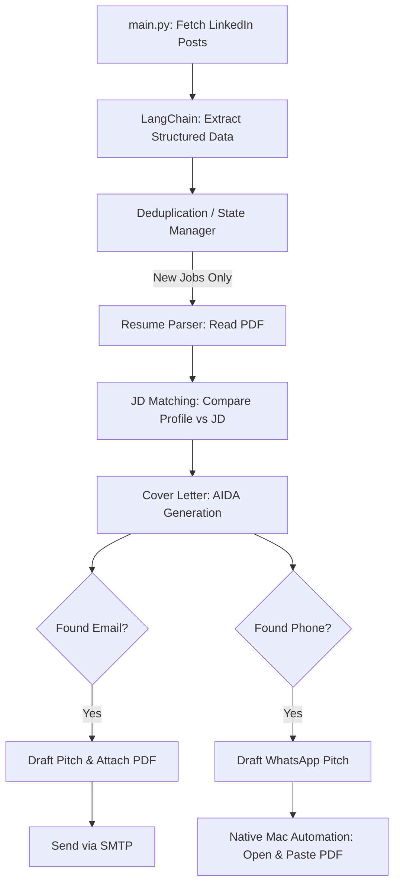

# 🚀 Agentic Career Ops

An end-to-end, fully autonomous AI agent pipeline that scrapes LinkedIn for jobs, matches them strictly against your personal master resume, and automatically drafts and sends highly tailored outreach emails and WhatsApp messages to recruiters.

No more manual job applications. One command runs the entire pipeline for you.

## 🌟 What It Does

When you run `python main.py --designation "Your Target Role"`, this system will:

1. **Scrape LinkedIn**: Uses Playwright to securely fetch the latest job posts matching your keyword.
2. **AI Extraction**: Feeds messy post text into LangChain + LLM to extract cleanly structured data (Company, Job Title, Location, Experience, Emails, Phones, URLs).
3. **Deduplication State**: Saves the structured output to Excel and tracks processed jobs in a JSON state file, ensuring you never double-contact a recruiter.
4. **Master Resume Parsing**: Scans for any PDF resume in `assets/resume/`, extracting your *actual* skills to prevent the LLM from hallucinating experiences you don't have.
5. **JD Matching**: Securely cross-references the job description strictly against your extracted resume profile to find the perfect overlap.
6. **Advanced Cover Letter Generation**: Uses the elite AIDA (Attention, Interest, Desire, Action) copywriting framework to generate a highly creative, impact-driven cover letter.
7. **Email Automation**: Drafts a concise email pitch, natively attaches your PDF resume, and automatically sends it via SMTP.
8. **WhatsApp Automation (Mac Native)**: Conditionally drafts a mobile-optimized chat message. It uses native Mac automation to automatically open WhatsApp Desktop, copy/paste your resume PDF, and send the pitch directly to the recruiter's phone!

## 🛠️ Architecture Workflow



## ⚙️ Installation & Setup

### 1. Prerequisites
- Python 3.9+
- A Mac (WhatsApp automation relies on native AppleScript).
- A valid [OpenRouter API Key](https://openrouter.ai/) for the LLM.

### 2. Clone and Install
```bash
git clone https://github.com/RohithGangarapu/Agentic-Career-Ops.git
cd Agentic-Career-Ops

# Create Virtual Environment
python -m venv venv
source venv/bin/activate

# Install Dependencies
pip install -r requirements.txt

# Install Playwright Browsers
playwright install
```

### 3. Environment Variables
Create a `.env` file in the root directory and add your keys:

```env
OPENROUTER_API_KEY="sk-or-v1-..."
OPENROUTER_MODEL="meta-llama/llama-3.1-8b-instruct"

# SMTP Configuration for Email Outreach
SMTP_SERVER="smtp.gmail.com"
SMTP_PORT="587"
SMTP_USER="your.email@gmail.com"
SMTP_PASSWORD="your-app-password"
```

### 4. Provide Your Resume
Place your master PDF resume (any filename is fine!) in the assets folder:
`assets/resume/your-resume-name.pdf`

*Note: The system caches your resume to `structured_resume.json` to save tokens. If you update your PDF, delete the JSON file to force a rebuild.*

## 🚀 Usage

Run the master orchestrator script with your target designation:

```bash
python main.py --designation "Python Developer" --max-posts 20
```

### What happens next?
- The system will boot up a hidden browser, pull 20 recent jobs for "Python Developer".
- It will parse them into an Excel file located in `.career_ops/exports/`.
- For every job that contains an email, it will silently draft and send an email with your resume attached.
- For every job that contains a phone number, it will take over your screen for ~5 seconds to natively launch WhatsApp, paste your message + PDF, and hit send.

Sit back, relax, and watch the interviews roll in.
